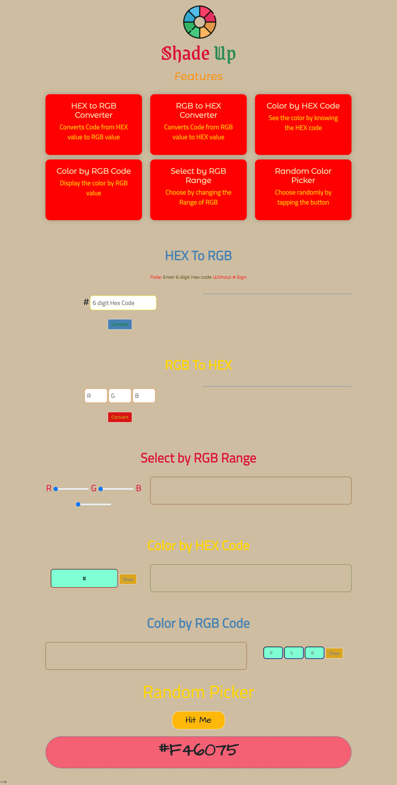

# RGB to Hex Converter

This webpage allows you to easily convert RGB colors to hexadecimal and vice versa. It also includes a random color picker to help you discover new color combinations.

## Features

- Convert RGB colors to hexadecimal
- Convert hexadecimal colors to RGB
- It also allows you to enter a hexadecimal and RGB color value and see the     resulting color displayed on the page.
- Pick a random color and see the corresponding RGB and hexadecimal values

## Usage

To use the RGB to hex converter, simply enter the red, green, and blue values of the RGB color in the input fields and click the "Convert" button. The hexadecimal value will be displayed in the output field.

To convert a hexadecimal color to RGB, enter the hexadecimal value in the input field and click the "Convert " button. The red, green, and blue values of the RGB color will be displayed in the output fields. 

To use the color display, simply enter a hexadecimal or RGB color value in the input field and press the "show" button. The color display will update to show the corresponding color.

You can also click the "Random Color" button to have the color display show a randomly generated color.

To pick a random color, click the "Hit Me" button. The corresponding RGB and hexadecimal values of the random color will be displayed in the output fields.

## Technologies

This webpage is built using HTML, CSS, and JavaScript. It makes use of the following libraries:

- [Bootstrap](https://getbootstrap.com/)

